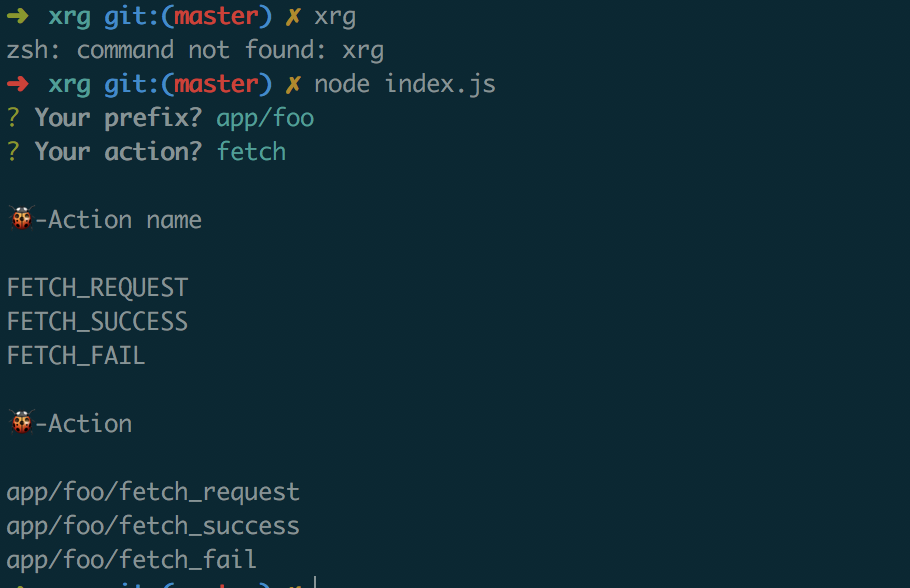

Tiny tool to generate redux action, 

```js
// input your prefix: 'app/foo'

// input your action: 'fetch'


FETCH_REQUEST
FETCH_SUCCESS
FETCH_FAIL

app/foo/fetch_request
app/foo/fetch_success
app/foo/fetch_fail

```



